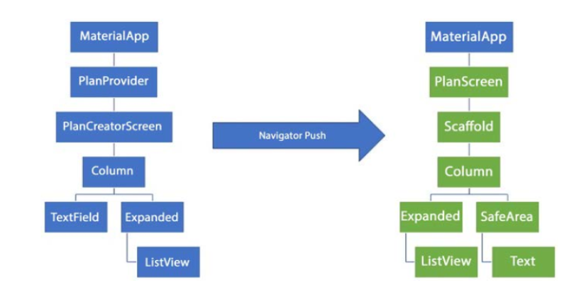

# Tugas Praktikum 1: Dasar State dengan Model-View
## 1. Selesaikan langkah-langkah praktikum tersebut, lalu dokumentasikan berupa GIF hasil akhir praktikum beserta penjelasannya di file README.md! Jika Anda menemukan ada yang error atau tidak berjalan dengan baik, silahkan diperbaiki.
## 2. Jelaskan maksud dari langkah 4 pada praktikum tersebut! Mengapa dilakukan demikian?
## 3. Mengapa perlu variabel plan di langkah 6 pada praktikum tersebut? Mengapa dibuat konstanta ?
## 4. Lakukan capture hasil dari Langkah 9 berupa GIF, kemudian jelaskan apa yang telah Anda buat!
## 5. Apa kegunaan method pada Langkah 11 dan 13 dalam lifecyle state ?

# Tugas Praktikum 2: InheritedWidget
## 1. Selesaikan langkah-langkah praktikum tersebut, lalu dokumentasikan berupa GIF hasil akhir praktikum beserta penjelasannya di file README.md! Jika Anda menemukan ada yang error atau tidak berjalan dengan baik, silakan diperbaiki sesuai dengan tujuan aplikasi tersebut dibuat.
## 2. Jelaskan mana yang dimaksud InheritedWidget pada langkah 1 tersebut! Mengapa yang digunakan InheritedNotifier?
## 3. Jelaskan maksud dari method di langkah 3 pada praktikum tersebut! Mengapa dilakukan demikian?
## 4. Lakukan capture hasil dari Langkah 9 berupa GIF, kemudian jelaskan apa yang telah Anda buat!

# Tugas Praktikum 3: State di Multiple Screens
## 1. Selesaikan langkah-langkah praktikum tersebut, lalu dokumentasikan berupa GIF hasil akhir praktikum beserta penjelasannya di file README.md! Jika Anda menemukan ada yang error atau tidak berjalan dengan baik, silahkan diperbaiki sesuai dengan tujuan aplikasi tersebut dibuat.
## 2. Berdasarkan Praktikum 3 yang telah Anda lakukan, jelaskan maksud dari gambar diagram berikut ini!

## 3. Lakukan capture hasil dari Langkah 14 berupa GIF, kemudian jelaskan apa yang telah Anda buat!

# Jawaban Praktikum 1 :

## 2. 
```markdown
## Langkah 4: Membuat file data_layer.dart

### Penjelasan
File `data_layer.dart` dibuat sebagai _barrel file_ yang mengelompokkan beberapa model
(`plan.dart` dan `task.dart`) agar lebih mudah diimpor

```dart
export 'plan.dart';
export 'task.dart';

### Tujuan
1. Menyederhanakan Impor: Mengimpor satu file (`data_layer.dart`) daripada mengimpor setiap file model secara terpisah.
2. Struktur Proyek Lebih Rapi: Mengelompokkan file terkait dalam satu _entry point_.
3. Mengurangi Duplikasi: Mencegah kesalahan impor yang berulang.
4. Skalabilitas: Memudahkan penambahan model baru di masa depan.
```

## 3. 
```markdown
## Langkah 6: Membuat plan_screen.dart

### Mengapa perlu variabel `plan`?
Variabel `plan` digunakan untuk menyimpan objek dari kelas `Plan` yang berisi daftar tugas.
Ini memungkinkan pengelolaan tugas seperti menambah, menghapus, atau mengedit melalui antarmuka pengguna.

### Mengapa dibuat konstanta (`const`)?
1. **Optimasi Kinerja:** Dibuat pada waktu kompilasi, lebih efisien.
2. **Mencegah Perubahan Tidak Sengaja:** Data `Plan` tetap (_immutable_).
3. **Konsistensi Data:** Menghindari bug akibat modifikasi yang tidak diinginkan.
```

## 5. 
```markdown
## Langkah 11 & 13: Scroll Listener & Dispose Method

### Kegunaan Method pada Lifecycle State

#### Langkah 11: `initState()`
- **Tujuan:** Menginisialisasi `scrollController` dan menambahkan _listener_ untuk mendeteksi aktivitas scroll.
- **Fungsi:** Menyembunyikan keyboard saat pengguna menggulir layar dengan menghapus fokus dari input aktif (`FocusNode()`).
- **Lifecycle:** Dipanggil sekali saat widget pertama kali dibuat.

#### Langkah 13: `dispose()`
- **Tujuan:** Membersihkan `scrollController` saat widget tidak lagi digunakan.
- **Fungsi:** Mencegah kebocoran memori (_memory leak_) dengan memanggil `dispose()` pada `scrollController`.
- **Lifecycle:** Dipanggil sekali saat widget dihapus dari pohon widget (_widget tree_).
```
